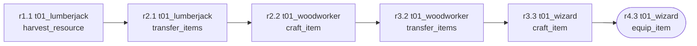
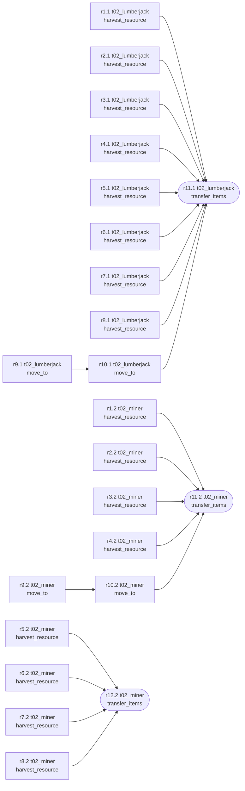

# AgentWorld-Lite results: hand-built tasks

Run on 2026-10-08. Seed 7, tasks in `tasks/main`.
- `gemma4:cloud`: Ollama cloud model on the free plan, called through the local Ollama server.
- `llama3.2:3b`: local, laptop RTX 2060 (6 GB), Ollama 0.40.0.
- Both use temperature 0.2, an 8192-token context and a 768-token output cap per turn.
- The oracle replays each task's reference solution; the random agent picks a random tool with plausible arguments (seeds 1–3).
- CCE: the table uses the LLM judge where it was run (`gemma4:cloud` episodes, judged by `gemma4:cloud` with the paper's backward-tracing procedure) and the rule-based judge elsewhere. The README reports rule-judge CCE for every row.
- Failure taxonomy: chat messages of the `gemma4:cloud` full-setting episodes, labelled by `gemma4:cloud`.

Generated with `python -m agentworld_lite report --runs runs/oracle runs/gemma4_cloud runs/llama3.2_3b runs/random --out docs/results.md --graphs 2`.

Episodes: 99 | systems x settings: 7

## Main results

| System | Setting | N | SR% | PSR% | CCE | CCE \| success | min PAC \| success | Avg rounds | Avg chats | Repeated chats % | Failed-action % | Deaths/ep | Cost $ | CCE judge |
|---|---|---|---|---|---|---|---|---|---|---|---|---|---|---|
| ollama:gemma4:cloud | full | 9 | 88.9 | 97.2 | 0.551 | 0.620 | 0.28 | 11.9 | 3.0 | 0.0 | 0.3 | 0.00 | 0.00 | llm |
| ollama:gemma4:cloud | no_comm | 9 | 77.8 | 77.8 | 0.409 | 0.526 | 0.17 | 14.8 | 0.0 | - | 4.9 | 0.00 | 0.00 | llm |
| ollama:llama3.2:3b | full | 9 | 0.0 | 3.7 | 0.000 | - | - | 26.6 | 55.6 | 84.4 | 16.8 | 0.22 | 0.00 | rule |
| ollama:llama3.2:3b | no_comm | 9 | 0.0 | 3.7 | 0.000 | - | - | 26.6 | 0.0 | - | 34.8 | 0.56 | 0.00 | rule |
| random | full | 27 | 0.0 | 5.6 | 0.000 | - | - | 26.6 | 8.1 | 58.3 | 53.0 | 0.96 | 0.00 | rule |
| random | no_comm | 27 | 0.0 | 3.7 | 0.000 | - | - | 26.6 | 0.0 | - | 58.1 | 1.15 | 0.00 | rule |
| scripted | full | 9 | 100.0 | 100.0 | 0.642 | 0.642 | 0.37 | 7.4 | 0.6 | 0.0 | 13.1 | 0.00 | 0.00 | rule |

CCE counts failed episodes as 0 (no success action, so the contributing set is empty); 'CCE | success' averages successful episodes only. min PAC = least-contributing agent's share of useful actions. Repeated chats = messages whose text was already sent earlier in the episode (judge-free proxy for stale/redundant messages).

## Success rate by category (%)

| Category | ollama:gemma4:cloud / full | ollama:gemma4:cloud / no_comm | ollama:llama3.2:3b / full | ollama:llama3.2:3b / no_comm | random / full | random / no_comm | scripted / full |
|---|---|---|---|---|---|---|---|
| combat | 100.0 | 100.0 | 0.0 | 0.0 | 0.0 | 0.0 | 100.0 |
| crafting | 100.0 | 0.0 | 0.0 | 0.0 | 0.0 | 0.0 | 100.0 |
| gathering | 100.0 | 100.0 | 0.0 | 0.0 | 0.0 | 0.0 | 100.0 |
| trading | 100.0 | 100.0 | 0.0 | 0.0 | 0.0 | 0.0 | 100.0 |
| exploration | 100.0 | 100.0 | 0.0 | 0.0 | 0.0 | 0.0 | 100.0 |
| survival | 100.0 | 100.0 | 0.0 | 0.0 | 0.0 | 0.0 | 100.0 |
| construction | 100.0 | 100.0 | 0.0 | 0.0 | 0.0 | 0.0 | 100.0 |
| coordination | 50.0 | 50.0 | 0.0 | 0.0 | 0.0 | 0.0 | 100.0 |

## Per-task outcomes

| Task | System / Setting | Success | PSR | Rounds | Chats | CCE | Verifier |
|---|---|---|---|---|---|---|---|
| t01_magic_staff | ollama:gemma4:cloud / full (s7) | ✓ | 1.00 | 9/25 | 4 | 0.67 | Staff equipped by wizard: True |
| t01_magic_staff | ollama:gemma4:cloud / no_comm (s7) | ✗ | 0.00 | 25/25 | 0 | 0.00 | Staff equipped by wizard: False |
| t01_magic_staff | ollama:llama3.2:3b / full (s7) | ✗ | 0.00 | 25/25 | 35 | 0.00 | Staff equipped by wizard: False |
| t01_magic_staff | ollama:llama3.2:3b / no_comm (s7) | ✗ | 0.00 | 25/25 | 0 | 0.00 | Staff equipped by wizard: False |
| t01_magic_staff | random / full (s1) | ✗ | 0.00 | 25/25 | 6 | 0.00 | Staff equipped by wizard: False |
| t01_magic_staff | random / full (s2) | ✗ | 0.00 | 25/25 | 5 | 0.00 | Staff equipped by wizard: False |
| t01_magic_staff | random / full (s3) | ✗ | 0.00 | 25/25 | 5 | 0.00 | Staff equipped by wizard: False |
| t01_magic_staff | random / no_comm (s1) | ✗ | 0.00 | 25/25 | 0 | 0.00 | Staff equipped by wizard: False |
| t01_magic_staff | random / no_comm (s2) | ✗ | 0.00 | 25/25 | 0 | 0.00 | Staff equipped by wizard: False |
| t01_magic_staff | random / no_comm (s3) | ✗ | 0.00 | 25/25 | 0 | 0.00 | Staff equipped by wizard: False |
| t01_magic_staff | scripted / full (s7) | ✓ | 1.00 | 4/25 | 0 | 0.50 | Staff equipped by wizard: True |
| t02_supply_run | ollama:gemma4:cloud / full (s7) | ✓ | 1.00 | 12/30 | 1 | 0.69 | Logs: 8/8, Copper ore: 4/4, Tin ore: 4/4 |
| t02_supply_run | ollama:gemma4:cloud / no_comm (s7) | ✓ | 1.00 | 12/30 | 0 | 0.66 | Logs: 8/8, Copper ore: 4/4, Tin ore: 4/4 |
| t02_supply_run | ollama:llama3.2:3b / full (s7) | ✗ | 0.00 | 30/30 | 73 | 0.00 | Logs: 0/8, Copper ore: 0/4, Tin ore: 0/4 |
| t02_supply_run | ollama:llama3.2:3b / no_comm (s7) | ✗ | 0.00 | 30/30 | 0 | 0.00 | Logs: 0/8, Copper ore: 0/4, Tin ore: 0/4 |
| t02_supply_run | random / full (s1) | ✗ | 0.00 | 30/30 | 8 | 0.00 | Logs: 0/8, Copper ore: 0/4, Tin ore: 0/4 |
| t02_supply_run | random / full (s2) | ✗ | 0.00 | 30/30 | 5 | 0.00 | Logs: 0/8, Copper ore: 0/4, Tin ore: 0/4 |
| t02_supply_run | random / full (s3) | ✗ | 0.00 | 30/30 | 5 | 0.00 | Logs: 0/8, Copper ore: 0/4, Tin ore: 0/4 |
| t02_supply_run | random / no_comm (s1) | ✗ | 0.00 | 30/30 | 0 | 0.00 | Logs: 0/8, Copper ore: 0/4, Tin ore: 0/4 |
| t02_supply_run | random / no_comm (s2) | ✗ | 0.00 | 30/30 | 0 | 0.00 | Logs: 0/8, Copper ore: 0/4, Tin ore: 0/4 |
| t02_supply_run | random / no_comm (s3) | ✗ | 0.00 | 30/30 | 0 | 0.00 | Logs: 0/8, Copper ore: 0/4, Tin ore: 0/4 |
| t02_supply_run | scripted / full (s7) | ✓ | 1.00 | 12/30 | 0 | 0.66 | Logs: 8/8, Copper ore: 4/4, Tin ore: 4/4 |
| t03_ogre_hunt | ollama:gemma4:cloud / full (s7) | ✓ | 1.00 | 5/25 | 2 | 0.72 | Ogre defeated: True |
| t03_ogre_hunt | ollama:gemma4:cloud / no_comm (s7) | ✓ | 1.00 | 7/25 | 0 | 0.60 | Ogre defeated: True |
| t03_ogre_hunt | ollama:llama3.2:3b / full (s7) | ✗ | 0.00 | 25/25 | 6 | 0.00 | Ogre defeated: False |
| t03_ogre_hunt | ollama:llama3.2:3b / no_comm (s7) | ✗ | 0.00 | 25/25 | 0 | 0.00 | Ogre defeated: False |
| t03_ogre_hunt | random / full (s1) | ✗ | 0.00 | 25/25 | 8 | 0.00 | Ogre defeated: False |
| t03_ogre_hunt | random / full (s2) | ✗ | 0.00 | 25/25 | 5 | 0.00 | Ogre defeated: False |
| t03_ogre_hunt | random / full (s3) | ✗ | 0.00 | 25/25 | 12 | 0.00 | Ogre defeated: False |
| t03_ogre_hunt | random / no_comm (s1) | ✗ | 0.00 | 25/25 | 0 | 0.00 | Ogre defeated: False |
| t03_ogre_hunt | random / no_comm (s2) | ✗ | 0.00 | 25/25 | 0 | 0.00 | Ogre defeated: False |
| t03_ogre_hunt | random / no_comm (s3) | ✗ | 0.00 | 25/25 | 0 | 0.00 | Ogre defeated: False |
| t03_ogre_hunt | scripted / full (s7) | ✓ | 1.00 | 3/25 | 0 | 0.78 | Ogre defeated: True |
| t04_market_day | ollama:gemma4:cloud / full (s7) | ✓ | 1.00 | 21/30 | 4 | 0.45 | Knight wields iron sword: True |
| t04_market_day | ollama:gemma4:cloud / no_comm (s7) | ✓ | 1.00 | 21/30 | 0 | 0.35 | Knight wields iron sword: True |
| t04_market_day | ollama:llama3.2:3b / full (s7) | ✗ | 0.00 | 30/30 | 73 | 0.00 | Knight wields iron sword: False |
| t04_market_day | ollama:llama3.2:3b / no_comm (s7) | ✗ | 0.00 | 30/30 | 0 | 0.00 | Knight wields iron sword: False |
| t04_market_day | random / full (s1) | ✗ | 0.00 | 30/30 | 6 | 0.00 | Knight wields iron sword: False |
| t04_market_day | random / full (s2) | ✗ | 0.00 | 30/30 | 5 | 0.00 | Knight wields iron sword: False |
| t04_market_day | random / full (s3) | ✗ | 0.00 | 30/30 | 11 | 0.00 | Knight wields iron sword: False |
| t04_market_day | random / no_comm (s1) | ✗ | 0.00 | 30/30 | 0 | 0.00 | Knight wields iron sword: False |
| t04_market_day | random / no_comm (s2) | ✗ | 0.00 | 30/30 | 0 | 0.00 | Knight wields iron sword: False |
| t04_market_day | random / no_comm (s3) | ✗ | 0.00 | 30/30 | 0 | 0.00 | Knight wields iron sword: False |
| t04_market_day | scripted / full (s7) | ✓ | 1.00 | 9/30 | 0 | 0.46 | Knight wields iron sword: True |
| t05_lost_shrine | ollama:gemma4:cloud / full (s7) | ✓ | 1.00 | 5/25 | 2 | 0.60 | Party at shrine: 3/3 |
| t05_lost_shrine | ollama:gemma4:cloud / no_comm (s7) | ✓ | 1.00 | 6/25 | 0 | 0.33 | Party at shrine: 3/3 |
| t05_lost_shrine | ollama:llama3.2:3b / full (s7) | ✗ | 0.00 | 25/25 | 38 | 0.00 | Party at shrine: 0/3 |
| t05_lost_shrine | ollama:llama3.2:3b / no_comm (s7) | ✗ | 0.00 | 25/25 | 0 | 0.00 | Party at shrine: 0/3 |
| t05_lost_shrine | random / full (s1) | ✗ | 0.00 | 25/25 | 4 | 0.00 | Party at shrine: 0/3 |
| t05_lost_shrine | random / full (s2) | ✗ | 0.00 | 25/25 | 7 | 0.00 | Party at shrine: 0/3 |
| t05_lost_shrine | random / full (s3) | ✗ | 0.00 | 25/25 | 7 | 0.00 | Party at shrine: 0/3 |
| t05_lost_shrine | random / no_comm (s1) | ✗ | 0.00 | 25/25 | 0 | 0.00 | Party at shrine: 0/3 |
| t05_lost_shrine | random / no_comm (s2) | ✗ | 0.00 | 25/25 | 0 | 0.00 | Party at shrine: 0/3 |
| t05_lost_shrine | random / no_comm (s3) | ✗ | 0.00 | 25/25 | 0 | 0.00 | Party at shrine: 0/3 |
| t05_lost_shrine | scripted / full (s7) | ✓ | 1.00 | 5/25 | 1 | 0.67 | Party at shrine: 3/3 |
| t06_wolf_siege | ollama:gemma4:cloud / full (s7) | ✓ | 1.00 | 10/14 | 1 | 0.93 | Rounds survived: 10/10, All alive: True, Campfire: 1/1, At camp: 3/3 |
| t06_wolf_siege | ollama:gemma4:cloud / no_comm (s7) | ✓ | 1.00 | 10/14 | 0 | 1.00 | Rounds survived: 10/10, All alive: True, Campfire: 1/1, At camp: 3/3 |
| t06_wolf_siege | ollama:llama3.2:3b / full (s7) | ✗ | 0.33 | 14/14 | 13 | 0.00 | Rounds survived: 10/10, All alive: False, Campfire: 0/1, At camp: 1/3 |
| t06_wolf_siege | ollama:llama3.2:3b / no_comm (s7) | ✗ | 0.33 | 14/14 | 0 | 0.00 | Rounds survived: 10/10, All alive: False, Campfire: 0/1, At camp: 1/3 |
| t06_wolf_siege | random / full (s1) | ✗ | 0.75 | 14/14 | 4 | 0.00 | Rounds survived: 10/10, All alive: True, Campfire: 1/1, At camp: 0/3 |
| t06_wolf_siege | random / full (s2) | ✗ | 0.25 | 14/14 | 3 | 0.00 | Rounds survived: 10/10, All alive: False, Campfire: 0/1, At camp: 0/3 |
| t06_wolf_siege | random / full (s3) | ✗ | 0.50 | 14/14 | 4 | 0.00 | Rounds survived: 10/10, All alive: False, Campfire: 1/1, At camp: 0/3 |
| t06_wolf_siege | random / no_comm (s1) | ✗ | 0.50 | 14/14 | 0 | 0.00 | Rounds survived: 10/10, All alive: True, Campfire: 0/1, At camp: 0/3 |
| t06_wolf_siege | random / no_comm (s2) | ✗ | 0.25 | 14/14 | 0 | 0.00 | Rounds survived: 10/10, All alive: False, Campfire: 0/1, At camp: 0/3 |
| t06_wolf_siege | random / no_comm (s3) | ✗ | 0.25 | 14/14 | 0 | 0.00 | Rounds survived: 10/10, All alive: False, Campfire: 0/1, At camp: 0/3 |
| t06_wolf_siege | scripted / full (s7) | ✓ | 1.00 | 10/14 | 0 | 0.73 | Rounds survived: 10/10, All alive: True, Campfire: 1/1, At camp: 3/3 |
| t07_outpost_walls | ollama:gemma4:cloud / full (s7) | ✓ | 1.00 | 13/40 | 8 | 0.44 | Palisade wall: 1/1, Campfire: 1/1 |
| t07_outpost_walls | ollama:gemma4:cloud / no_comm (s7) | ✓ | 1.00 | 20/40 | 0 | 0.31 | Palisade wall: 1/1, Campfire: 1/1 |
| t07_outpost_walls | ollama:llama3.2:3b / full (s7) | ✗ | 0.00 | 40/40 | 105 | 0.00 | Palisade wall: 0/1, Campfire: 0/1 |
| t07_outpost_walls | ollama:llama3.2:3b / no_comm (s7) | ✗ | 0.00 | 40/40 | 0 | 0.00 | Palisade wall: 0/1, Campfire: 0/1 |
| t07_outpost_walls | random / full (s1) | ✗ | 0.00 | 40/40 | 17 | 0.00 | Palisade wall: 0/1, Campfire: 0/1 |
| t07_outpost_walls | random / full (s2) | ✗ | 0.00 | 40/40 | 8 | 0.00 | Palisade wall: 0/1, Campfire: 0/1 |
| t07_outpost_walls | random / full (s3) | ✗ | 0.00 | 40/40 | 17 | 0.00 | Palisade wall: 0/1, Campfire: 0/1 |
| t07_outpost_walls | random / no_comm (s1) | ✗ | 0.00 | 40/40 | 0 | 0.00 | Palisade wall: 0/1, Campfire: 0/1 |
| t07_outpost_walls | random / no_comm (s2) | ✗ | 0.00 | 40/40 | 0 | 0.00 | Palisade wall: 0/1, Campfire: 0/1 |
| t07_outpost_walls | random / no_comm (s3) | ✗ | 0.00 | 40/40 | 0 | 0.00 | Palisade wall: 0/1, Campfire: 0/1 |
| t07_outpost_walls | scripted / full (s7) | ✓ | 1.00 | 10/40 | 0 | 0.50 | Palisade wall: 1/1, Campfire: 1/1 |
| t08_crystal_plates | ollama:gemma4:cloud / full (s7) | ✗ | 0.75 | 20/20 | 4 | 0.00 | Plates: 3/4 |
| t08_crystal_plates | ollama:gemma4:cloud / no_comm (s7) | ✗ | 0.00 | 20/20 | 0 | 0.00 | Plates: 0/4 |
| t08_crystal_plates | ollama:llama3.2:3b / full (s7) | ✗ | 0.00 | 20/20 | 73 | 0.00 | Plates: 0/4 |
| t08_crystal_plates | ollama:llama3.2:3b / no_comm (s7) | ✗ | 0.00 | 20/20 | 0 | 0.00 | Plates: 0/4 |
| t08_crystal_plates | random / full (s1) | ✗ | 0.00 | 20/20 | 3 | 0.00 | Plates: 0/4 |
| t08_crystal_plates | random / full (s2) | ✗ | 0.00 | 20/20 | 9 | 0.00 | Plates: 0/4 |
| t08_crystal_plates | random / full (s3) | ✗ | 0.00 | 20/20 | 8 | 0.00 | Plates: 0/4 |
| t08_crystal_plates | random / no_comm (s1) | ✗ | 0.00 | 20/20 | 0 | 0.00 | Plates: 0/4 |
| t08_crystal_plates | random / no_comm (s2) | ✗ | 0.00 | 20/20 | 0 | 0.00 | Plates: 0/4 |
| t08_crystal_plates | random / no_comm (s3) | ✗ | 0.00 | 20/20 | 0 | 0.00 | Plates: 0/4 |
| t08_crystal_plates | scripted / full (s7) | ✓ | 1.00 | 4/20 | 4 | 1.00 | Plates: 4/4 |
| t09_harvest_feast | ollama:gemma4:cloud / full (s7) | ✓ | 1.00 | 12/30 | 1 | 0.46 | Fish stew: 3/3, Herbal tonic: 2/2 |
| t09_harvest_feast | ollama:gemma4:cloud / no_comm (s7) | ✓ | 1.00 | 12/30 | 0 | 0.43 | Fish stew: 3/3, Herbal tonic: 2/2 |
| t09_harvest_feast | ollama:llama3.2:3b / full (s7) | ✗ | 0.00 | 30/30 | 84 | 0.00 | Fish stew: 0/3, Herbal tonic: 0/2 |
| t09_harvest_feast | ollama:llama3.2:3b / no_comm (s7) | ✗ | 0.00 | 30/30 | 0 | 0.00 | Fish stew: 0/3, Herbal tonic: 0/2 |
| t09_harvest_feast | random / full (s1) | ✗ | 0.00 | 30/30 | 17 | 0.00 | Fish stew: 0/3, Herbal tonic: 0/2 |
| t09_harvest_feast | random / full (s2) | ✗ | 0.00 | 30/30 | 15 | 0.00 | Fish stew: 0/3, Herbal tonic: 0/2 |
| t09_harvest_feast | random / full (s3) | ✗ | 0.00 | 30/30 | 14 | 0.00 | Fish stew: 0/3, Herbal tonic: 0/2 |
| t09_harvest_feast | random / no_comm (s1) | ✗ | 0.00 | 30/30 | 0 | 0.00 | Fish stew: 0/3, Herbal tonic: 0/2 |
| t09_harvest_feast | random / no_comm (s2) | ✗ | 0.00 | 30/30 | 0 | 0.00 | Fish stew: 0/3, Herbal tonic: 0/2 |
| t09_harvest_feast | random / no_comm (s3) | ✗ | 0.00 | 30/30 | 0 | 0.00 | Fish stew: 0/3, Herbal tonic: 0/2 |
| t09_harvest_feast | scripted / full (s7) | ✓ | 1.00 | 10/30 | 0 | 0.48 | Fish stew: 3/3, Herbal tonic: 2/2 |

## Communication failure taxonomy

| System / Setting | Messages | Flagged % | stale_redundant | misidentification | factual_error | premature_completion | non_material | logical_inconsistency |
|---|---|---|---|---|---|---|---|---|
| ollama:gemma4:cloud / full | 27 | 22.2 | 66.7 | 0.0 | 33.3 | 0.0 | 0.0 | 0.0 |

Category shares are percentages of flagged (non-'none') messages, as in the paper.

## CCE judge agreement (rule vs LLM)

Episodes: 15 | mean raw agreement: 0.810 | mean Cohen's kappa: 0.601

## Causal action graphs (contributing actions only)

### t01_magic_staff — scripted / full (CCE 0.50, judge=rule)

### t02_supply_run — scripted / full (CCE 0.66, judge=rule)

